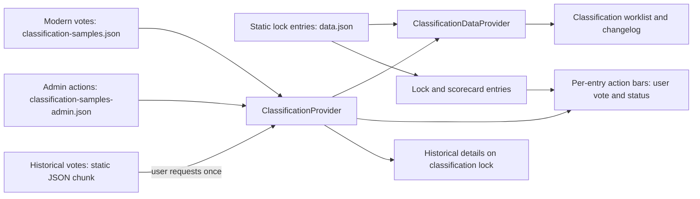

# Classification functionality and data overview

Status: current implementation and decision input, reviewed 2026-10-08. This is an inventory and evaluation brief, not an approved Firebase design. Record counts describe the JSON files in this revision; they are not live service counts.

## Purpose and scope

Classification lets eligible members inspect proposed lock rankings, see belt votes, and prepare administrative ranking decisions. The current site is a read-only preview backed by bundled JSON. The next design needs to make modern votes and supporting actions durable and writable while keeping historical votes in a static archive. It also needs to serve three different reading patterns: a classification worklist, the signed-in member's vote indicator on lock and scorecard entries, and vote details opened on demand.

The term **modern vote** below means a record in `classification-samples.json`, including records imported from the Classification Sheet. **Historical vote** means a record in `classification-votes-historical.json`; this archive remains static. **Previous vote** is the current code's name for a modern vote before a ranking milestone. These are distinct datasets and should remain distinct in the next data model.

## Current user journeys and implementation status

| Surface | What works now | Current boundary |
| --- | --- | --- |
| `/classification` | Role-gated worklist of active locks. Search, filters, sorting, vote chips, status flags, and expandable lock/vote details. | Uses bundled votes and admin actions. Vote and admin forms are previews with disabled save controls. |
| `/classification/previous` | Route and tab exist. | Page only displays “1,927 previous votes here soon”; it is not a historical or previous-vote browser yet. |
| `/classification/changelog` | Shows staged admin actions grouped as additions, upgrades, downgrades, or unchanged; offers clipboard, CSV, and JSON export. | Based on five sample actions. The visible Publish button has no publish handler. |
| Lock list / lock details | Eligible users see their current `votedBelt` in a belt icon and can open the vote panel to see their vote details. | Lock entries are not enriched with the classification worklist's `currentVotes`/`previousVotes`, so the panel normally has only the signed-in user's vote. The “Classification” feature filter is inferred from the static sample votes. |
| Scorecard lock rows | An owner or admin who can expand a lock row can use the same action bar, belt icon, and on-demand vote panel. | The scorecard entry also lacks worklist vote arrays. Availability follows scorecard row access and the action-bar feature gate. |
| Historical detail | On an expanded lock in the classification worklist, “CHECK FOR HISTORICAL VOTES” loads the entire historical JSON chunk once, then shows matching votes. | This is an on-demand load of the whole archive, not a per-lock request. It is unavailable from the lock/scorecard panels because that button is limited to classification routes. |

The route guard accepts the authenticated `admin`, `classificationAdmin`, `lpuMod`, or `classificationTeam` claim. `AccessContext` gives those roles the `classificationVote` feature, while `admin` and `classificationAdmin` also get `classificationAdmin`. The navigation menu currently advertises Classification only to `admin`, although the route guard admits the other roles. These are client presentation rules; future reads and writes need rules or trusted server authorization based on authenticated claims. UI switches such as `adminEnabled` do not grant access.

Key entry points: [routes](../src/app/routes.jsx), [parent route](../src/classification/ClassificationParentRoute.jsx), [access policy](../src/app/AccessContext.jsx), [action bar](../src/entries/EntryActionBar.jsx), [scorecard row](../src/scorecard/ScorecardEntry.jsx), [navigation menu](../src/nav/menuConfig.jsx).

## Current data flow

`ClassificationParentRoute` mounts `FilterProvider`, `ClassificationProvider`, and `ClassificationUIProvider` for the classification children, passing the static lock catalog through the router outlet. `ClassificationDataProvider` then maps **every** lock to a derived row for the worklist and changelog. It computes current/previous votes, status, vote counts, consensus, highest voted belt, latest vote date, searchable voter names, and filter values. The worklist includes entries considered active, not simply every entry with a vote. `EntryActionBar` separately mounts a `ClassificationProvider` for each rendered action bar on lock, scorecard, and classification entries. This duplicates provider instances and entry grouping work; it matters when replacing an in-memory array with subscriptions or queries.

The lock list's `LockDataProvider` independently scans the sample vote array to add the `Classification` feature label. The scorecard data provider combines scorecard activity with static lock entries but does not add classification vote arrays. Today the action bar's user vote comes from its own `ClassificationProvider`, and its expanded detail receives whichever vote arrays the entry already has. A future data service should define one owner for each read and an explicit contract for a compact per-entry indicator versus full details.

Sources: [classification context](../src/app/ClassificationContext.jsx), [classification row mapping](../src/classification/ClassificationDataProvider.jsx), [lock row mapping](../src/locks/LockDataProvider.jsx), [scorecard row mapping](../src/scorecard/ScorecardDataProvider.jsx), [action bar](../src/entries/EntryActionBar.jsx).

### Current interpretation of a classification round

`getLatestMilestone(entry)` takes the later of the lock's `currentBeltDate` and the `updatedAt` values of its `Published` admin actions, or the Unix epoch if neither exists. A modern vote with `updatedAt >= milestone` is **current**; an earlier modern vote is **previous**. `getUserVote` returns the first matching current vote for the signed-in Firebase UID after sorting newest first. There is no separate round identifier or uniqueness rule in this data. A user's edit that updates `updatedAt` could therefore move an old vote into a newer round unless the next design defines round membership explicitly.

The latest admin action at or after the milestone supplies its status. With no such action, status is `Has Votes` or `No Votes`. A lock is active if its assigned belt is `Unranked`, or its status is `Re-opened`, `Pending`, `Staged`, or `Has Votes`. The changelog selects active rows with `Staged` status. `Settled` disables the add-vote affordance, although an existing vote still shows an Edit control in this preview. The status list and form expose more states than the five sample actions exercise: `Draft`, `Pending`, `Staged`, `Published`, `Re-opened`, `Settled`, and `Error` appear in the UI configuration, while `Has Votes` and `No Votes` are computed fallbacks.

Vote statistics count all current modern records, with consensus defined as at least three votes for one belt and more than half of current votes for that belt. Voter/belt filters narrow the `currentVotes` shown in a worklist row, but aggregate statistics use all current votes. A move to server summaries must preserve that distinction and the current sort/filter contract, or deliberately change it.

Sources: [classification context](../src/app/ClassificationContext.jsx), [vote statistics](../src/classification/classificationVoteStats.js), [filter fields](../src/data/filterFields.js), [sort fields](../src/data/sortFields.js), [vote panel](../src/classification/EntryClassificationVote.jsx).

## Existing record contracts and dataset observations

| Dataset | Size in this revision | Fields and role | Loading behavior |
| --- | --- | --- | --- |
| [Modern sample votes](../src/data/classification-samples.json) | 148 records, about 84 KB; 83 lock IDs, 37 distinct `userId` values | `id`, `entryId`, `userId`, `displayName`, `votedBelt`, `comment`, `source`, `type`, `createdAt`, `updatedAt`; sheet-related fields include `sheetRow`, `lockname`, `ranking`, `sheetLink`. | Static import by classification context **and** lock-list mapping; included in application bundles. Proposed Firebase migration target. |
| [Sample admin actions](../src/data/classification-samples-admin.json) | 5 records, about 2.7 KB; 5 lock IDs | `id`, `entryId`, `userId`, `displayName`, `status`, `action`, `updatedBelt`, `samelineTarget`, `note`, `includeInChangelog`, `publishedAt`, `source`, `createdAt`, `updatedAt`; the preview form also refers to `omitChangelog`. | Static import by classification context and directly by the admin preview. A durable workflow needs an authoritative owner for these too. |
| [Historical votes](../src/data/classification-votes-historical.json) | 1,927 records, about 808 KB; 423 lock IDs, 505 distinct `userId` values | `id`, `type: historicalVote`, `entryId`, `votedBelt`, `comment`, `userId`, `displayName`, `source`, `createdAt`, `updatedAt`. | Dynamic JSON import on request, cached and grouped by entry for the current session. Remains static. |
| [Lock catalog](../src/data/data.json) | 974 lock entries | Stable `id`, assigned `belt`, and other lock metadata; `currentBeltDate` is read by classification logic. | Bundled static catalog used to join records by `entryId`. |

Dates in the JSON are parseable strings. The preview vote form collects `votedBelt`, optional `comment`, and optional `mediaUrl`, with a helper to use the member's scorecard video URL. No sample modern vote contains `mediaUrl`. The form currently performs client checks for a required belt and URL syntax, but it cannot submit. The admin preview collects status, action, target belt, changelog note and omission preference, but it cannot save, stage, delete, or publish. Future persisted fields, validation, and authorization must be specified together rather than inferred from disabled controls.

Data issues to resolve before import or enforcing constraints:

- No lock in the current bundled catalog has `currentBeltDate`. With no `Published` sample action, the current milestone is the epoch, so all 148 modern sample records are treated as current. The import script contains code to set `currentBeltDate` for some belt changes, but the present catalog does not provide it.
- Five modern `(entryId, userId)` pairs have two records. Two of those pairs use the sentinel `userId: "unknown"`; 32 modern records have that sentinel. A unique vote-per-user-per-round key cannot be imposed blindly on imported data. Some paired votes disagree on belt.
- Modern `type` is `vote` for 137 records and has other values (`PT+`, `D+`, `PT / S`) for 11. The current context does not filter by `type`; these records count as votes. Decide whether those values are vote metadata, special votes, or import errors before migration.
- Historical records contain 438 synthetic `u_...` user IDs and 55 `Unknown` display names. Four records reference two lock IDs absent from the current catalog. One historical record has a blank belt. Keep the archival record intact while defining display and lookup behavior for incomplete data.
- The historical conversion script assigns artificial timestamps beginning 2026-10-01, with minutes added by column position. These dates should not be treated as actual vote chronology. The checked-in historical file is the archive; its generating script reads credentialed Google Sheet data and writes a different filename (`classification--votes-historical.json` under `src/data/classification/`). Do not use that script as a validation command or assume it regenerates the checked-in file exactly.
- The code has no identified generator for the two sample JSON files. Establish provenance and whether the sample modern records are a complete, authoritative migration set before any import.

These observations came from a local, read-only count of the checked-in JSON on 2026-10-08. No live Firebase or Sheet data was accessed. Sources: [historical conversion script](../scripts/getClassificationSheetData.js), [lock import date logic](../scripts/import.js), [vote preview](../src/classification/VoteForm.jsx), [admin preview](../src/classification/EntryClassificationAdmin.jsx).

## Read and write requirements for the next design

| Use case | Minimum data and access pattern | Freshness / consistency need |
| --- | --- | --- |
| Lock and scorecard vote icon | Current authenticated user's `votedBelt` and whether the lock accepts votes, keyed by `entryId`; ideally batched for visible rows. | Reflect a successful vote/edit without a page rebuild. Avoid one subscription per row. |
| On-demand vote detail | Full current user's vote (`comment`, `mediaUrl`, dates) for an opened entry; optionally other current and previous modern votes where policy permits. | Fetch only when panel opens, or reuse a bounded list already loaded by classification. |
| Classification worklist | Active lock IDs, effective status, current votes, voter/belt filters, vote statistics and sort keys, with staged actions. | Updates after votes and admin changes. Define whether a live listener is needed or a refreshed query is enough. |
| Historical detail | Static archived votes by lock ID, loaded on demand. | Versioned with site releases; never mixed into modern current counts or writable records. |
| Member vote write | Create/edit own vote, validated belt/comment/media and authenticated actor, tied to a classification round. | Decide whether there is one effective vote per authenticated member per lock per round; duplicate requests and concurrent edits need deterministic behavior. |
| Admin workflow | Create/update status and decision, stage, publish, settle/reopen, and generate a changelog. | Publishing must update the assigned lock belt and round boundary consistently with the existing lock-data owner. Record actor, timestamps, and immutable publication history. |

The last two rows are requirements to design, not implemented capabilities. A publication spans more than a vote document: the assigned belt currently comes from static lock data, and the sibling server repository owns exports and API services. Determine how a published decision reaches the authoritative lock catalog and its generated/public consumers. A button that changes only a Firestore status would leave displayed belts and round boundaries inconsistent.

## Data strategy options to evaluate

| Approach | Fit and advantages | Main costs and questions |
| --- | --- | --- |
| **Firestore documents queried by the client** for modern votes and actions | Matches the application's existing Firebase Auth and Firestore usage. Per-user and per-entry queries can update views promptly. A bounded role-gated worklist may be feasible at the present 148-record scale. | Requires deployed security rules for every read/write, indexes for `entryId`, `userId`, round/status and ordering, and a deliberate way to avoid a listener per lock row. Full vote comments in broad client queries may exceed the intended access/privacy scope. |
| **Firestore source plus a trusted API/read projection** | Centralizes policy and can return a compact per-user indicator, a worklist summary, and details separately. It can join static lock metadata and enforce publishing transactions. Fits the existing server/API ownership if that service is chosen. | Adds server endpoint, cache/invalidation, and deployment ownership. Worklist search/filter over individual voter names or belts may require a richer projection or detail fetch. The sibling server repository must be inspected before choosing its implementation. |
| **Firestore source plus generated static summaries** | Cheap list reads and good fit for a catalog that already ships static data. Modern vote details could still be fetched on demand. | Summary freshness follows an export/build pipeline; this is a poor fit for immediate vote feedback unless paired with a live per-user read. A static export must not include data that is meant to remain access-controlled. Exporters are live-data operations and approval-gated. |

All approaches keep the historical archive static. A useful decision is likely a combination of a durable source for modern votes/actions, a small read model for indicators and worklist rows, and on-demand detail reads. The option assessment should compare measured data size, update frequency, role visibility, latency, Firestore read costs, offline behavior, and operational ownership. Do not use a single giant document or an unbounded per-row subscription to reproduce the current in-memory array.

Before implementing any option, specify the record and round model:

1. Choose stable vote IDs and whether an effective vote is keyed by `(entryId, roundId, authenticatedUserId)`; retain legacy/source IDs separately if needed. Define revision history versus overwriting the effective vote.
2. Choose an explicit round/decision ID or a durable milestone. Specify what a vote edit does at a publish boundary, how reopened classifications work, and how the historical static archive differs from modern previous rounds.
3. Define whether admin actions are mutable work items plus an immutable publication event, and which status transitions are legal. Align `includeInChangelog` in the sample with `omitChangelog` in the form.
4. Define read visibility for belt, voter identity, comment, and media URL separately for owners, classification roles, admins, and the public. Current bundled JSON is downloadable as site assets and cannot establish private-data policy.
5. Define server-side field validation, actor stamping, timestamp source, idempotency, and edit/delete permissions. Claims, Firestore rules, and/or trusted server code must enforce them; `accessInfo` only controls presentation.
6. Decide where the lock's effective classification flag, assigned belt, round boundary, and aggregate vote statistics live, who updates them, and how they reconcile with static `data.json` and exports.

No Firestore rules file is declared in this repository's `firebase.json`, so a client-write design needs a separately reviewed and testable deployed-rules plan. Existing `DBContext` uses Firestore, but it has no classification read/write API. The nearby ranking-request subscription is an example of the SDK pattern, not a classification authorization contract. Sources: [Firebase configuration](../firebase.json), [DBContext](../src/app/DBContext.jsx), [ranking-request route](../src/rankingRequests/ViewLockRequestsRoute.jsx), [Firebase safety reference](../.agents/references/firebase-data-safety.md).

## Suggested evaluation and implementation sequence

1. **Confirm product rules:** eligible voters and readers, whether vote identity/comments are visible to other team members, one effective vote per round, edit/deletion rules, state transitions, and publish ownership. Resolve the duplicate/sentinel import cases explicitly.
2. **Define canonical records and queries:** document the modern vote, round, admin decision, publication event, and compact indicator/summary contracts. Make each UI read above map to one bounded query or endpoint; estimate query/index/read cost against measured and expected scale.
3. **Prototype with synthetic data:** test claim-based authorization, round transitions, duplicate submissions, and two simultaneous edits against emulators or an isolated API. Add rules tests if using direct Firestore reads/writes. Do not use production credentials or live data for automated tests.
4. **Migrate readers before writes:** replace the sample-source dependencies in `ClassificationProvider`, `LockDataProvider`, and admin preview with one data owner. Keep the worklist's aggregate/filter semantics and the lock/scorecard indicator/detail split explicit. Preserve loading, error, and empty states.
5. **Enable writes and publication separately:** persist votes and admin work items with server-enforced policy. Then integrate publication with the authoritative lock-data/export pipeline and changelog. Verify rollback/retry behavior before enabling a publish control.
6. **Retire sample imports and validate:** compare expected counts and representative records, including duplicate identities and anomalous types; keep historical votes static. Run focused classification/context tests, broader frontend tests for shared data-flow changes, and targeted browser/emulator coverage for the authenticated journey.

Existing tests cover milestone/current-vs-previous behavior, historical lazy loading and caching, vote filters and aggregate counts, role features, and disabled preview controls: [context tests](../tests/vitest/ClassificationContext.test.jsx), [worklist tests](../tests/vitest/ClassificationDataProvider.test.jsx), [historical display tests](../tests/vitest/EntryClassificationVote.test.jsx), [preview tests](../tests/vitest/ClassificationPreview.test.jsx). There is no classification end-to-end journey in `tests/e2e` yet.

## Decisions to bring to the strategy review

- Which roles may see all modern votes and comments, and which may see only their own vote or an aggregate?
- Is the modern sample file the complete migration source, and how should unknown users, duplicate `(entryId, userId)` pairs, and special `type` values be interpreted?
- Should a member have one editable vote per classification round, and may they vote again after a belt is published or a classification is reopened?
- Does “previous votes” mean previous **modern rounds**, the static historical archive, or both in separate views?
- Which system publishes an assigned belt into the static lock catalog, and what freshness is acceptable on the site after publication?
- Must the worklist update live for multiple reviewers, or is an explicit refresh acceptable? What are expected votes, active locks, and concurrent reviewer counts beyond the sample dataset?

Answering these determines the security boundary, query shape, migration mapping, and whether direct Firestore reads or a server projection best fits the feature.
