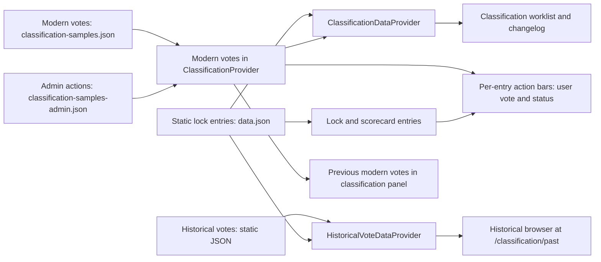

# Classification functionality and data overview

Status: current implementation and recorded product decisions, updated 2026-10-09. This is an inventory and evaluation brief, not an approved Firebase design. Record counts describe the JSON files in this revision; they are not live service counts.

## Purpose and scope

Classification lets eligible members inspect proposed lock rankings, see belt votes, and prepare administrative ranking decisions. The current site is a read-only preview backed by bundled JSON. The next design needs to make modern votes and supporting actions durable and writable while keeping historical votes in a static archive. It also needs to serve three different reading patterns: a classification worklist, the signed-in member's vote indicator on lock and scorecard entries, and vote details opened on demand.

The term **modern vote** below means a record in `classification-samples.json`, extracted from the [Sheet of Record (S.O.R.)](https://docs.google.com/spreadsheets/d/1OJSQki_FDe8KtgQ0b1BJ9I21R6bnyNcFAZmQVtgx438/edit?gid=1613106571#gid=1613106571) using `scripts/getClassificationSheetData.js`, according to the project owner. The sample is incomplete; the full migration source will use the same format. **Historical vote** means a record in `classification-votes-historical.json`; this archive remains static. `ClassificationProvider` reads only modern votes. Its current **previous votes** are modern records before a ranking milestone. The historical archive has a separate provider and is displayed only at `/classification/past`. Product usage of “previous votes” refers only to previous modern rounds.

## Current user journeys and implementation status

| Surface | What works now | Current boundary |
| --- | --- | --- |
| `/classification` | Role-gated worklist of active locks. Search, filters, sorting, vote chips, status flags, and expandable lock/vote details. | Uses bundled votes and admin actions. Vote and admin forms are previews with disabled save controls. |
| `/classification/past` | Role-gated historical-vote browser with search, filters, sorting, vote chips, and read-only vote details on expanded locks. Only locks with matching archived votes appear. | Uses the bundled static archive. Votes whose `entryId` is absent from the lock catalog have no row. Synthetic timestamps represent within-lock sequence, not actual dates. |
| `/classification/changelog` | Shows staged admin actions grouped as additions, upgrades, downgrades, or unchanged; offers clipboard, CSV, and JSON export. | Based on five test-only admin actions. The visible Publish button has no publish handler. |
| Lock list / lock details | Eligible users see their current `votedBelt` in a belt icon and can open the vote panel to see their vote details. | Lock entries are not enriched with the classification worklist's `currentVotes`/`previousVotes`, so the panel normally has only the signed-in user's vote. The “Classification” feature filter is inferred from the static sample votes. |
| Scorecard lock rows | An owner or admin who can expand a lock row can use the same action bar, belt icon, and on-demand vote panel. | The scorecard entry also lacks worklist vote arrays. Availability follows scorecard row access and the action-bar feature gate. |
| Previous modern vote detail | On an expanded lock in the classification worklist, modern records before the latest ranking milestone appear in a “Previous votes” section. | Historical records are absent from this panel and from lock/scorecard panels. |

The route guard accepts the authenticated `admin`, `classificationAdmin`, `lpuMod`, or `classificationTeam` claim, or a black-belt award in the signed-in user's loaded `lockcollections` profile. `UIContext` derives that profile role from `DBContext` and waits for a profile snapshot associated with the current user, so a previous account's profile cannot grant access during an account switch. The navigation menu shows Classification to the same eligible users. All of these eligible users may read all modern votes and comments. Only `admin` and `classificationAdmin` may create or edit admin actions. `AccessContext` gives the claimed roles the `classificationVote` feature, while `admin` and `classificationAdmin` also get `classificationAdmin`; a black belt without one of those claims can browse Classification but does not receive vote or admin controls. These are client presentation rules. Future protected reads and writes need rules or trusted server authorization that checks the appropriate claim or trusted profile field. UI switches such as `adminEnabled` do not grant access.

Key entry points: [routes](../src/app/routes.jsx), [parent route](../src/classification/ClassificationParentRoute.jsx), [claim access policy](../src/app/AccessContext.jsx), [profile UI access](../src/app/UIContext.jsx), [action bar](../src/entries/EntryActionBar.jsx), [scorecard row](../src/scorecard/ScorecardEntry.jsx), [navigation menu](../src/nav/menuConfig.jsx).

## Current data flow

`ClassificationParentRoute` mounts `FilterProvider` and `ClassificationProvider` for the classification children, passing the static lock catalog through the router outlet. `ClassificationProvider` groups only the 148 modern votes by entry once when the module loads. `ClassificationDataProvider` then maps **every** lock to a derived row for the worklist and changelog. It computes current/previous modern votes, status, vote counts, consensus, highest voted belt, latest vote date, searchable voter names, and filter values. The worklist includes unranked entries and ranked entries with an active classification admin action. A vote by itself does not put a ranked entry on the worklist. `EntryActionBar` separately mounts a `ClassificationProvider` for each rendered action bar on lock, scorecard, and classification entries. The static grouping is shared, but the provider instances remain separate; this matters when replacing the arrays with subscriptions or queries.

The lazy `/classification/past` child loads `HistoricalVoteDataProvider` and the archived JSON. It groups historical records by lock, builds rows only for catalog locks with archive records, and shows filtered vote chips and read-only details. The shared classification row component suppresses the vote/admin action bar on this route. The classification parent still mounts the modern context on `/classification/past`, but the historical browser uses its own data provider. Historical records do not enter `currentVotes` or `previousVotes` on modern worklist rows. Historical vote counts and highest-belt sort values come from the archive; voter/belt filters narrow the displayed votes while counts still describe all archive votes on a lock. The derived `latestVoteDate` uses synthetic `createdAt` values and must not be treated as an actual event date.

The lock list's `LockDataProvider` independently scans the sample vote array to add the `Classification` feature label. The scorecard data provider combines scorecard activity with static lock entries but does not add classification vote arrays. Today the action bar's user vote comes from its own `ClassificationProvider`, and its expanded detail receives whichever vote arrays the entry already has. A future data service should define one owner for each read and an explicit contract for a compact per-entry indicator versus full details.

Sources: [classification context](../src/app/ClassificationContext.jsx), [classification row mapping](../src/classification/ClassificationDataProvider.jsx), [historical row mapping](../src/classification/HistoricalVoteDataProvider.jsx), [lock row mapping](../src/locks/LockDataProvider.jsx), [scorecard row mapping](../src/scorecard/ScorecardDataProvider.jsx), [action bar](../src/entries/EntryActionBar.jsx).

### Current interpretation of a classification round

`getLatestMilestone(entry)` takes the later of the lock's `currentBeltDate` and the `updatedAt` values of its `Published` admin actions, or the Unix epoch if neither exists. A modern record with `type: "vote"` and `updatedAt >= milestone` is **current**; an earlier modern vote is **previous**. `getUserVote` returns the first matching current vote for the signed-in Firebase UID after sorting newest first. `loggedInUserVotes` and `allVotes` expose modern votes only. Historical records are outside this round model and appear only in the historical browser. There is no separate round identifier or uniqueness rule in this data. This timestamp-based rule does not implement the decided reopening behavior: when a lock is `Re-opened`, all its modern votes must count as current, and a returning voter edits their existing vote rather than creating another. Publication and previous-modern-round display still need an explicit model that preserves that one-vote identity across reopening.

The latest admin action at or after the milestone supplies its status. With no such action, status is `Has Votes` or `No Votes`. A lock is active if its assigned belt is `Unranked`, or a current admin action has status `Re-opened`, `Pending`, or `Staged`. The latter states represent the reopened classification workflow for ranked locks. `Has Votes` is only a fallback status and does not activate a ranked lock. The changelog selects active rows with `Staged` status. `Settled` disables the add-vote affordance, although an existing vote still shows an Edit control in this preview. The status list and form expose more states than the five sample actions exercise: `Draft`, `Pending`, `Staged`, `Published`, `Re-opened`, `Settled`, and `Error` appear in the UI configuration, while `Has Votes` and `No Votes` are computed fallbacks.

Vote statistics count all current modern records, with consensus defined as at least three votes for one belt and more than half of current votes for that belt. Voter/belt filters narrow the `currentVotes` shown in a worklist row, but aggregate statistics use all current votes. A move to server summaries must preserve that distinction and the current sort/filter contract, or deliberately change it.

Sources: [classification context](../src/app/ClassificationContext.jsx), [vote statistics](../src/classification/classificationVoteStats.js), [filter fields](../src/data/filterFields.js), [sort fields](../src/data/sortFields.js), [vote panel](../src/classification/EntryClassificationVote.jsx).

## Existing record contracts and dataset observations

| Dataset | Size in this revision | Fields and role | Loading behavior |
| --- | --- | --- | --- |
| [Modern sample votes](../src/data/classification-samples.json) | 148 records, about 67 KB; 83 lock IDs, 67 distinct `userId` values | `id`, `entryId`, `userId`, `displayName`, `votedBelt`, `comment`, `source`, `type`, `createdAt`, `updatedAt`; sheet-related fields include `sheetRow`, `lockname`, `ranking`, `sheetLink`. | Static import by classification context **and** lock-list mapping; included in application bundles. Extracted from the S.O.R.; the complete migration source will use the same format. |
| [Sample admin actions](../src/data/classification-samples-admin.json) | 5 test records, about 2.7 KB; 5 lock IDs | `id`, `entryId`, `userId`, `displayName`, `status`, `action`, `updatedBelt`, `samelineTarget`, `note`, `includeInChangelog`, `publishedAt`, `source`, `createdAt`, `updatedAt`; the preview form also refers to `omitChangelog`. | Static import by classification context and directly by the admin preview. These are test data, not migration records; future real admin actions need a durable owner. |
| [Historical votes](../src/data/classification-votes-historical.json) | 1,927 records, about 668 KB; 423 lock IDs, 505 distinct `userId` values | `id`, `type: historicalVote`, `entryId`, `votedBelt`, `comment` on most records, `userId`, `displayName`, `createdAt`. No `updatedAt` or `source` is present. | Static import by the lazy `/classification/past` route's data provider. The archive remains static and is not part of `ClassificationContext`. |
| [Lock catalog](../src/data/data.json) | 974 lock entries; 18 with `currentBeltDate` | Stable `id`, assigned `belt`, and other lock metadata; `currentBeltDate` is read by classification logic. | Bundled static catalog used to join records by `entryId`. |

Dates in the JSON are parseable strings. The preview vote form collects `votedBelt`, optional `comment`, and optional `mediaUrl`, with a helper to use the member's scorecard video URL. No sample modern vote contains `mediaUrl`. The form currently performs client checks for a required belt and URL syntax, but it cannot submit. The admin preview collects status, action, target belt, changelog note and omission preference, but it cannot save, stage, delete, or publish. Future persisted fields, validation, and authorization must be specified together rather than inferred from disabled controls.

Data preparation and remaining caveats:

- The lock catalog now contains `currentBeltDate` on 18 entries. The import script preserves that date in both the historical record and generated lock entry. The 18 dates precede the modern sample votes, so all 148 modern votes currently fall in the current round. Locks without the field still use the epoch unless they have a `Published` admin action.
- The 148 modern records have unique `(entryId, userId)` pairs and all have `type: "vote"`. Duplicate pairs and special type values have been removed from the migration data. There are no `userId: "unknown"` sentinels in the current file. Thirty votes have distinct synthetic `u_...` IDs for unknown users; the migration and read model must support these IDs without collapsing them into one voter. Whether a synthetic voter can later claim a vote remains unspecified.
- Historical records contain 438 synthetic `u_...` user IDs and 55 `Unknown` display names. Four records reference two lock IDs absent from the current catalog, so those records have no row in the current historical browser. Keep the archival record intact while defining display and lookup behavior for incomplete data.
- The checked-in historical archive uses artificial `createdAt` timestamps beginning 2026-10-01, with minutes added by vote-column position. The resulting order represents the vote sequence within a lock's spreadsheet row; actual calendar dates are unknown. The historical provider uses this order within a lock. The historical browser omits a cross-lock “Recently Updated” sort because these timestamps are not event dates. The script's current active path extracts modern votes from the S.O.R.; its historical-export path is commented out and writes a different filename (`classification--votes-historical.json` under `src/data/classification/`).
- `classification-samples-admin.json` is entirely test data. It demonstrates the preview workflow but should not be imported as actual decisions. The checked-in modern vote extract is incomplete; obtain the full source in the same format for migration and retain distinct synthetic voter IDs.

These observations came from a local, read-only count of the workspace JSON on 2026-10-09 and the project owner's description of the S.O.R. The linked Sheet itself was not accessed for independent review. No live Firebase or Sheet data was accessed. Sources: [classification extraction script](../scripts/getClassificationSheetData.js), [lock import date logic](../scripts/import.js), [vote preview](../src/classification/VoteForm.jsx), [admin preview](../src/classification/EntryClassificationAdmin.jsx).

## Read and write requirements for the next design

| Use case | Minimum data and access pattern | Freshness / consistency need |
| --- | --- | --- |
| Lock and scorecard vote icon | Current authenticated user's `votedBelt` and whether the lock accepts votes, keyed by `entryId`; ideally batched for visible rows. The existing `lockcollections` profile subscription is one possible place for a copy of the user's votes. | The signed-in user's own vote must update in real time, including on lock and scorecard routes. Avoid one subscription per row. |
| On-demand vote detail | Full current user's vote (`comment`, `mediaUrl`, dates) and all modern votes and comments on the opened entry for any eligible classification-site user. | Fetch only when panel opens, or reuse a bounded list already loaded by classification. Near real-time updates are sufficient for non-admin readers; if explicit refresh is needed, indicate it. |
| Classification worklist | Active lock IDs, effective status, current votes, voter/belt filters, vote statistics and sort keys, with staged actions. | Live updates for logged-in admins. Near real-time updates are sufficient for other classification users; explicit refresh is acceptable if the UI indicates new data is available. |
| Historical detail | Static archived votes by lock ID, loaded through the `/classification/past` route. | Versioned with site releases; separate from modern current and previous votes, modern counts, and writable records. |
| Member vote write | Create one vote per authenticated member per lock and edit that vote on reopening; validate belt/comment/media and authenticated actor. | All modern votes count as current when a lock is `Re-opened`. Duplicate requests and concurrent edits need deterministic behavior. |
| Admin workflow | `admin` and `classificationAdmin` may create/update status and decision, stage, publish, settle/reopen, and generate a changelog. | A published belt reaches the static catalog through the manually triggered Sheet import. Record actor, timestamps, and immutable publication history. |

The last two rows are requirements to design, not implemented capabilities. The static lock catalog is currently updated by manually running `scripts/import.js` against the [lock catalog Google Sheet](https://docs.google.com/spreadsheets/d/1IDuO-g0fSkElbiDJFU2F10V3I1o4w5FhW88k1Cdsn2c/edit?gid=0#gid=0). Today, changelog publication reaches the site after a few days; this workflow should shorten that delay, but no numeric freshness target is set. A later phase may evaluate writing published belts to the Sheet directly. The publication design must account for the manual Sheet-to-catalog step so displayed belts and round boundaries remain consistent. The sibling server repository owns exports and API services.

## Data strategy options to evaluate

| Approach | Fit and advantages | Main costs and questions |
| --- | --- | --- |
| **Firestore documents queried by the client** for modern votes and actions | Matches the application's existing Firebase Auth and Firestore usage. Per-user and per-entry queries can update views promptly. A bounded role-gated worklist may be feasible, subject to analysis beyond the incomplete 148-record sample. | Requires deployed security rules for every read/write, indexes for `entryId`, `userId`, round/status and ordering, and a deliberate way to avoid a listener per lock row. Full vote comments must remain readable only to eligible classification-site users. |
| **Firestore source plus a trusted API/read projection** | Centralizes policy and can return a compact per-user indicator, a worklist summary, and details separately. It can join static lock metadata and record publication decisions. Fits the existing server/API ownership if that service is chosen. | Adds server endpoint, cache/invalidation, and deployment ownership. Worklist search/filter over individual voter names or belts may require a richer projection or detail fetch. The sibling server repository must be inspected before choosing its implementation. |
| **Firestore source plus generated static summaries** | Cheap list reads and good fit for a catalog that already ships static data. Modern vote details could still be fetched on demand. | Summary freshness follows an export/build pipeline; this is a poor fit for immediate vote feedback unless paired with a live per-user read. A static export must not include data that is meant to remain access-controlled. Exporters are live-data operations and approval-gated. |

All approaches keep the historical archive static. The historical JSON is now imported by the lazy `/classification/past` child rather than `ClassificationContext`, reducing the archive's presence in lock, scorecard, and current-classification paths. The 2026-10-09 test build emits a 568.85 KB `HistoricalVotesRoute` chunk (119.77 KB gzip); the archive is therefore a substantial cost only when that route is loaded. A useful decision is likely a combination of a durable source for modern votes/actions, a small read model for indicators and worklist rows, and on-demand detail reads. The option assessment should compare measured data size, update frequency, role visibility, latency, Firestore read costs, offline behavior, and operational ownership. It must support live worklist updates for admins and real-time feedback for each user's own vote. Do not use a single giant document or an unbounded per-row subscription to reproduce the current in-memory array.

Before implementing any option, specify the record and round model:

1. Choose stable vote IDs and enforce one editable modern vote per `(entryId, userId)` across reopening; retain legacy/source IDs separately if needed. Support distinct synthetic `u_...` users and define revision history versus overwriting the effective vote.
2. Choose an explicit round/decision ID or a durable milestone for publication history and previous-modern-round display. On `Re-opened`, treat all modern votes on the lock as current and allow a returning member to edit their existing vote. Keep the historical static archive separate.
3. Define whether admin actions are mutable work items plus an immutable publication event, and which status transitions are legal. Align `includeInChangelog` in the sample with `omitChangelog` in the form.
4. Enforce read access to all modern votes and comments for `admin`, `classificationAdmin`, `lpuMod`, `classificationTeam`, and signed-in users with the `blackBelt` profile role. Define media URL visibility and any access outside the classification site separately. Current bundled JSON is downloadable as site assets and cannot establish private-data policy.
5. Define server-side field validation, actor stamping, timestamp source, idempotency, and edit/delete permissions. Claims, Firestore rules, and/or trusted server code must enforce them; `accessInfo` only controls presentation.
6. Decide where the lock's effective classification flag, assigned belt, round boundary, and aggregate vote statistics live, who updates them, and how they reconcile with the manual Google Sheet import into static `data.json` and exports.

No Firestore rules file is declared in this repository's `firebase.json`, so a client-write design needs a separately reviewed and testable deployed-rules plan. Existing `DBContext` uses Firestore, but it has no classification read/write API. The nearby ranking-request subscription is an example of the SDK pattern, not a classification authorization contract. Sources: [Firebase configuration](../firebase.json), [DBContext](../src/app/DBContext.jsx), [ranking-request route](../src/rankingRequests/ViewLockRequestsRoute.jsx), [Firebase safety reference](../.agents/references/firebase-data-safety.md).

## Suggested evaluation and implementation sequence

1. **Resolve remaining product rules:** eligible voters, edit/deletion rules outside reopening, legal state transitions, media URL visibility, and whether synthetic legacy voter IDs can be claimed or remain unclaimed. Keep the decided reader/admin roles and one-vote-per-lock rule in the design.
2. **Define canonical records and queries:** document the modern vote, round, admin decision, publication event, and compact indicator/summary contracts. Make each UI read above map to one bounded query or endpoint; estimate query/index/read cost after expected votes, active locks, and concurrent reviewers are analyzed.
3. **Prototype with synthetic data:** test claim-based authorization, round transitions, duplicate submissions, and two simultaneous edits against emulators or an isolated API. Add rules tests if using direct Firestore reads/writes. Do not use production credentials or live data for automated tests.
4. **Migrate readers before writes:** replace the sample-source dependencies in `ClassificationProvider`, `LockDataProvider`, and admin preview with one data owner. Keep the worklist's aggregate/filter semantics and the lock/scorecard indicator/detail split explicit. Preserve loading, error, and empty states.
5. **Enable writes and publication separately:** persist votes and admin work items with server-enforced policy. Then connect publication and changelog handling to the existing manual Google Sheet-to-catalog import process. Verify retry and reconciliation behavior before enabling a publish control.
6. **Retire sample imports and validate:** compare expected counts, identities, and representative records with the complete modern source in the same format; exclude the test-only admin actions and keep historical votes static in the separate past route. Run focused classification/context tests, broader frontend tests for shared data-flow changes, and targeted browser/emulator coverage for the authenticated journey.

Existing tests cover milestone/current-vs-previous behavior for modern votes, exclusion of historical records from the context, separate read-only historical display, vote filters and aggregate counts, claim and profile route access, role features, and disabled preview controls: [context tests](../tests/vitest/ClassificationContext.test.jsx), [worklist tests](../tests/vitest/ClassificationDataProvider.test.jsx), [historical browser tests](../tests/vitest/HistoricalVoteDataProvider.test.jsx), [access tests](../tests/vitest/ClassificationAccess.test.jsx), [vote display tests](../tests/vitest/EntryClassificationVote.test.jsx), [preview tests](../tests/vitest/ClassificationPreview.test.jsx). There is no classification end-to-end journey in `tests/e2e` yet.

## Decisions recorded for the strategy review

- All classification-site users may see all modern votes and comments. Site access is granted by the `admin`, `classificationAdmin`, `lpuMod`, or `classificationTeam` claim, or the `blackBelt` profile role. Only `admin` and `classificationAdmin` may create or edit admin actions.
- The checked-in modern sample is incomplete. The complete migration source will use the same format. Duplicate `(entryId, userId)` pairs and special type values have been removed; distinct `u_...` IDs for unknown users must be supported.
- A member has one editable modern vote per lock. When a lock is `Re-opened`, all its modern votes are current; a member edits their previous vote instead of creating a new one.
- “Previous votes” refers to previous modern rounds, not the static historical archive.
- The static catalog is updated by a manual `scripts/import.js` run from the lock catalog Google Sheet. The current changelog-to-site delay is a few days; a faster process is expected, with direct Sheet updates deferred for later evaluation.
- Logged-in admins need a live worklist. Near real-time updates suffice for other classification users, with explicit refresh allowed when the UI indicates it is needed. Each user's own vote must update in real time; a copy in their subscribed `lockcollections` profile is one option for lock and scorecard routes.

## Outstanding analysis and design choices

- Analyze expected vote volume, active lock counts, and concurrent reviewers beyond the incomplete sample before selecting queries and subscriptions.
- Decide whether synthetic legacy votes can be claimed, how media URLs are exposed, and the remaining vote edit/deletion and status-transition rules.
- Define how previous modern rounds are presented after publication and how a reopened lock's votes return to the current view. Decide whether previous modern rounds need a browser beyond the current panel; the static historical archive stays separate.
- Set an operational freshness target and reconciliation process for changelog publication, the manual Sheet import, and site updates.

These choices determine the query shape, migration mapping, and whether direct Firestore reads or a server projection best fits the feature.
